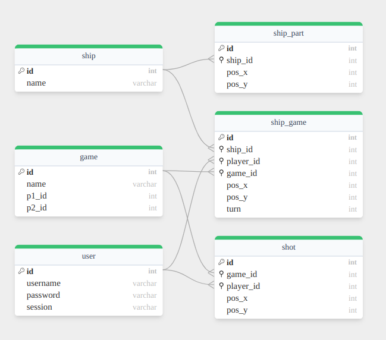

# Battleships

"Simple" project to implement the game of Battleships in go and sveltekit. I am still working on it, all of the code needs to be refactored and cleaned up as I am mostly focused on learning the basics of sveltekit and go.

The app is not in playable state yet.

## Running the project

TODO

## Project structure

Project is split into 2 main parts. Frontend and backend. Frontend has its own backed that is used to communicate with the game logic backend. This was done so that any kind of frontend can be used with the game logic backend in future (terminal, android, ios).

battle_ships - sveltekit frontend and backend for frontend

battle_ships_api - go backend for the game logic and login

database - TODO

## Database

